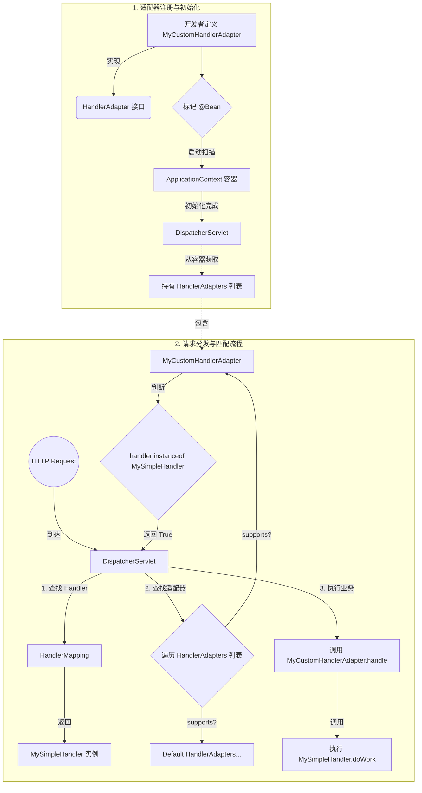

> `DispatcherServlet` 通过 `HandlerMapping` 返回了需要处理的 Controller
>
> 通过统一的方式，帮助 `DispatcherServlet` 处理不同的 controller

## 工作原理

- `supports(Object handler)` (handler 匹配)：
  - `DispatcherServlet` 遍历所有注册的 `HandlerAdapter` 实例；
  - 找到合适的 Adapter

- `handle(HttpServletRequest, HttpServletResponse, Object handler)`（执行阶段）：
  - 调用 `handlerAdapter` 的 `handler` 方法
  - 参数绑定、业务处理、异常拦截、封装结果到 `ModelAndView`

## 默认适配器

| 适配器名称 | 支持的处理器类型 | 备注 |
|---|---|---|
| `RequestMappingHandlerAdapter` | 标注了 `@RequestMapping` 的方法 | 核心适配器，支持参数解析、返回值处理、数据校验等最强功能。 |
| `HttpRequestHandlerAdapter` | 实现了 `HttpRequestHandler` 接口的类 | 通常用于处理静态资源请求。 |
| `SimpleControllerHandlerAdapter` | 实现了 `Controller` 接口的类 | 兼容老版本基于接口开发的控制器。 |

## 自定义 HandlerAdapter

### 先定义接口

```java
public interface MyCustomHandler {
    void doWork(HttpServletRequest request, HttpServletResponse response) throws Exception;
}
```

### 自定义 Adapter

自定义 `Adapter`，实现 `HandlerAdapter` 接口

`DispatcherServlet` 通过 `supports` 方法寻找具体的 handler

```java
public class MyCustomHandlerAdapt implements HandlerAdapter {

    // 只处理 MyCustomHandler 类型
    @Override
    public boolean supports(Object handler) {
        return (handler instanceof MyCustomHandler);
    }

    // 实际处理逻辑
    @Override
    public ModelAndView handle(HttpServletRequest request, HttpServletResponse response, Object handler) throws Exception {
        ((MyCustomHandler)handler).doWork(request, response);
        return null;
    }

    /**
     * @param request
     * @param handler
     * @deprecated
     */
    @Override
    public long getLastModified(HttpServletRequest request, Object handler) {
        return -1;
    }

}
```

### 注册为 bean

```java
@Configuration
public class CustomHandlerConfig {

    @Bean
    public MyCustomHandlerAdapt myCustomHandlerAdapt(){
        return new MyCustomHandlerAdapt();
    }
}
```

## 如何使用自定义 HandlerAdapter

### 通过 Bean 名称查找

```java

@Component
public class CustomController {

    @Bean("/api/custom/test")
    public MyCustomHandler customHandler() {
        return new MyCustomHandlerImpl();
    }
}
```

返回的是 `MyCustomHandler`，而在 `MyCustomAdapter` 中的 `Support` 方法中，正是通过
是否 `instanceof MyCustomHandler` 来确定使用的是哪个 `Adapter`。

## 总结



### 1. 注册 HandlerAdapter

- 通过 `implements` `HandlerAdapter` 接口，实现自定义的 `Adapter`
- 在 Spring 容器中注册 `Adapter`: 通过 `@Configuration` `@Bean` 注入容器

### 2. 判断是否使用该 Adapter

- 通过 `HandlerAdapter` 的 `support` 方法判断是否满足条件

### 3. 寻找 Handler

在步骤 2 中，`support` 方法通过 `handler` 对象判断，那么 `handler` 对象如何得到?

通过简单的 `Bean` 名称就可以找到

`HandlerMapping` 通过匹配 url 来搜寻，通过返回的对象，判断是否满足 `support` 方法


