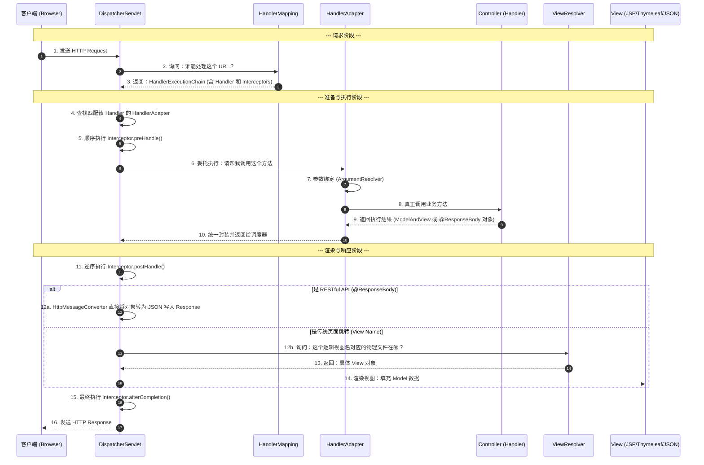

```mermaid
sequenceDiagram
autonumber
participant Browser as 客户端 (Browser)
participant DS as DispatcherServlet
participant HM as HandlerMapping
participant HA as HandlerAdapter
participant Ctrl as Controller (Handler)
participant VR as ViewResolver
participant View as View (JSP/Thymeleaf/JSON)

    Note over Browser, View: --- 请求阶段 ---
    Browser->>DS: 1. 发送 HTTP Request
    DS->>HM: 2. 询问：谁能处理这个 URL？
    HM-->>DS: 3. 返回：HandlerExecutionChain (含 Handler 和 Interceptors)

    Note over Browser, View: --- 准备与执行阶段 ---
    DS->>DS: 4. 查找匹配该 Handler 的 HandlerAdapter
    DS->>DS: 5. 顺序执行 Interceptor.preHandle()

    DS->>HA: 6. 委托执行：请帮我调用这个方法
    HA->>HA: 7. 参数绑定 (ArgumentResolver)
    HA->>Ctrl: 8. 真正调用业务方法
    Ctrl-->>HA: 9. 返回执行结果 (ModelAndView 或 @ResponseBody 对象)
    HA-->>DS: 10. 统一封装并返回给调度器

    Note over Browser, View: --- 渲染与响应阶段 ---
    DS->>DS: 11. 逆序执行 Interceptor.postHandle()
    
    alt 是 RESTful API (@ResponseBody)
        DS->>DS: 12a. HttpMessageConverter 直接将对象转为 JSON 写入 Response
    else 是传统页面跳转 (View Name)
        DS->>VR: 12b. 询问：这个逻辑视图名对应的物理文件在哪？
        VR-->>DS: 13. 返回：具体 View 对象
        DS->>View: 14. 渲染视图：填充 Model 数据
    end

    DS->>DS: 15. 最终执行 Interceptor.afterCompletion()
    DS-->>Browser: 16. 发送 HTTP Response
```