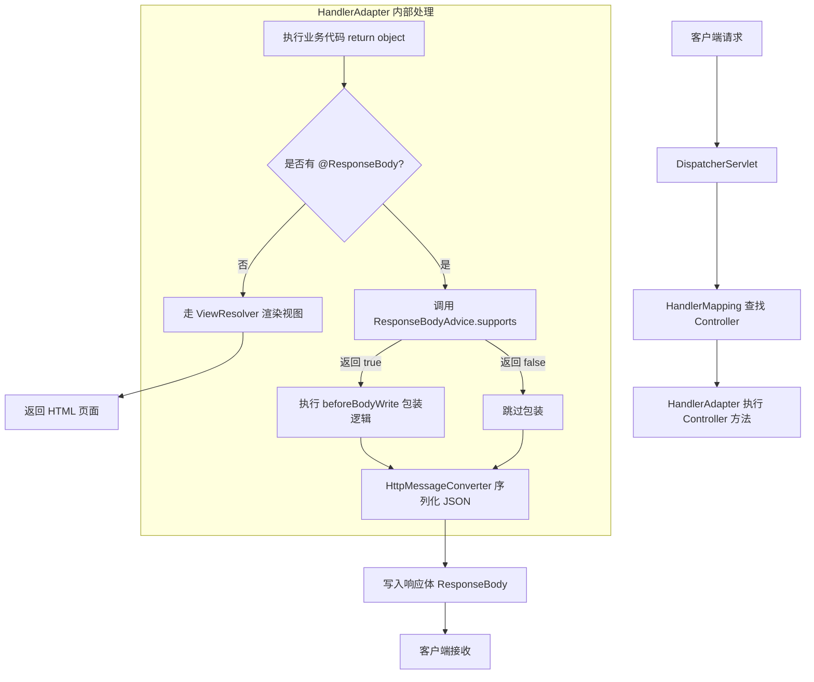

## 作用

将 controller 返回的结果，在写入 body 前，统一处理。

## 范围

只对有 `@ResponseBody` 注解的有效，包括：
- `@ResponseBody`
- `@RestController`

## 执行顺序图



## 使用

### 1. 定义包装 DTO

```java
public class ResponseDTO<T> {
    public String message;
    public int code;
    public T data;

    public static <T> ResponseDTO<T> success(T data) {
        ResponseDTO<T> responseDTO = new ResponseDTO<T>();
        responseDTO.message = "success";
        responseDTO.data = data;
        responseDTO.code = 200;
        return responseDTO;
    }
}
```

### 2. 定义 ResponseAdvice

> 实现接口 `ResponseBodyAdvice`

```java
@ControllerAdvice(basePackages = "com.tml.demo")
public class GlobalResponseAdvice implements ResponseBodyAdvice<Object> {

    @Override
    public boolean supports(MethodParameter returnType, Class<? extends HttpMessageConverter<?>> converterType) {
        // 判断是否处理
        // 跳过 ResponseDTO.class
        return !returnType.getParameterType().isAssignableFrom(ResponseDTO.class);
    }

    @Nullable
    @Override
    public Object beforeBodyWrite(@Nullable Object body, MethodParameter returnType, MediaType selectedContentType, Class<? extends HttpMessageConverter<?>> selectedConverterType, ServerHttpRequest request, ServerHttpResponse response) {
        if(body instanceof String){
            ObjectMapper objectMapper = new ObjectMapper();
            try {
                return objectMapper.writeValueAsString(ResponseDTO.success(body));
            } catch (JsonProcessingException e) {
                throw new RuntimeException(e);
            }
        }

        return ResponseDTO.success(body);
    }
}
```

- `@ControllerAdvice(basePackages = "com.tml.demo")`: 指定作用范围，扫描的包名
- `supports` 方法：判断是否启用该 Advice
- `beforeBodyWrite`：具体执行封装的方法，需要注意：
  - string 类型的结果，需要特殊处理
    - 需要先转换成 json 字符串，再返回，否则会被强制转换成字符串的时候报错
