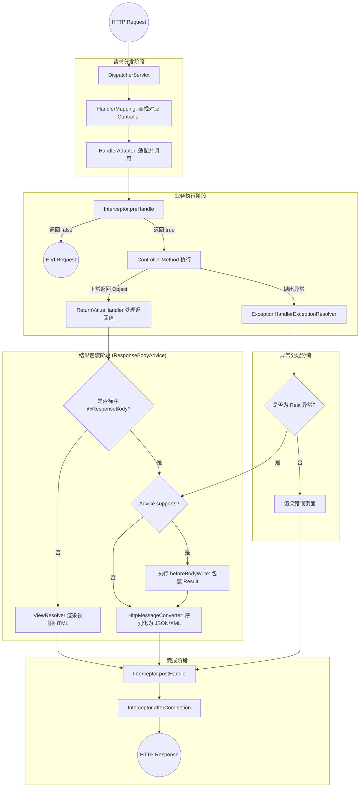

```mermaid
graph TD
    Start((HTTP Request)) --> Dispatcher[DispatcherServlet]
    
    subgraph "请求分发阶段"
        Dispatcher --> Mapping[HandlerMapping: 查找对应 Controller]
        Mapping --> Adapter[HandlerAdapter: 适配并调用]
    end

    subgraph "业务执行阶段"
        Adapter --> InterceptorPre[Interceptor.preHandle]
        InterceptorPre -- 返回 false --> Stop((End Request))
        InterceptorPre -- 返回 true --> Controller[Controller Method 执行]
        
        Controller -- 抛出异常 --> ExceptionHandler[ExceptionHandlerExceptionResolver]
        Controller -- 正常返回 Object --> ReturnHandler[ReturnValueHandler 处理返回值]
    end

    subgraph "结果包装阶段 (ResponseBodyAdvice)"
        ReturnHandler --> HasAnnotation{是否标注 @ResponseBody?}
        HasAnnotation -- 否 --> ViewResolve[ViewResolver 渲染视图/HTML]
        HasAnnotation -- 是 --> AdviceSupport{Advice.supports?}
        
        AdviceSupport -- 是 --> BeforeWrite[执行 beforeBodyWrite: 包装 Result]
        AdviceSupport -- 否 --> Converter[HttpMessageConverter: 序列化为 JSON/XML]
        
        BeforeWrite --> Converter
    end

    subgraph "异常处理分流"
        ExceptionHandler --> ErrorFormat{是否为 Rest 异常?}
        ErrorFormat -- 是 --> AdviceSupport
        ErrorFormat -- 否 --> ErrorPage[渲染错误页面]
    end

    subgraph "完成阶段"
        ViewResolve --> InterceptorPost[Interceptor.postHandle]
        Converter --> InterceptorPost
        ErrorPage --> InterceptorPost
        
        InterceptorPost --> AfterCompletion[Interceptor.afterCompletion]
        AfterCompletion --> Response((HTTP Response))
    end
```