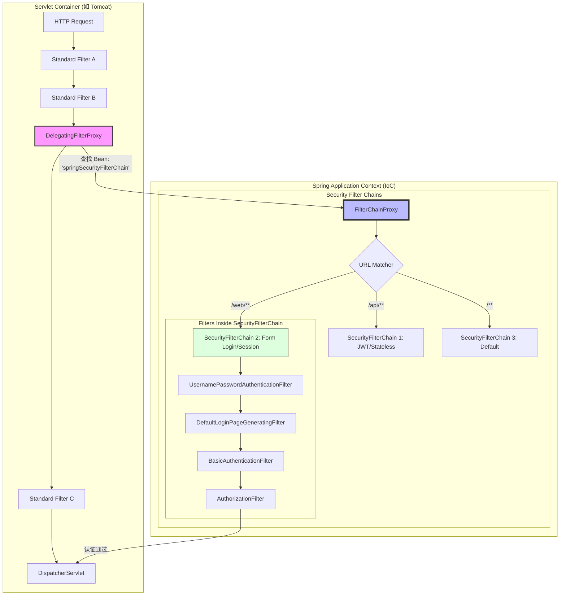

## 系统架构

- `Servlet Filter Chain`: `Servlet`本身有一个过滤器链。
- `DelegatingFilterProxy`: 作为`SpringApplicationContext`与原生`Servelt`过滤器之间的桥梁，可以加载`Bean`
- `SpringSecurityFilterChain`：这个就是`DelegatingFilterProxy`需要加载的`Bean`
- `SecurityFilterChain`: 真正执行过滤的地方，可以加载`Filter`执行过滤
  - `Filter`通常不是`Bean`，否则可能会被调用两次：
    1. `Spring`容器调用1次
    2. `Spring Security`调用1次